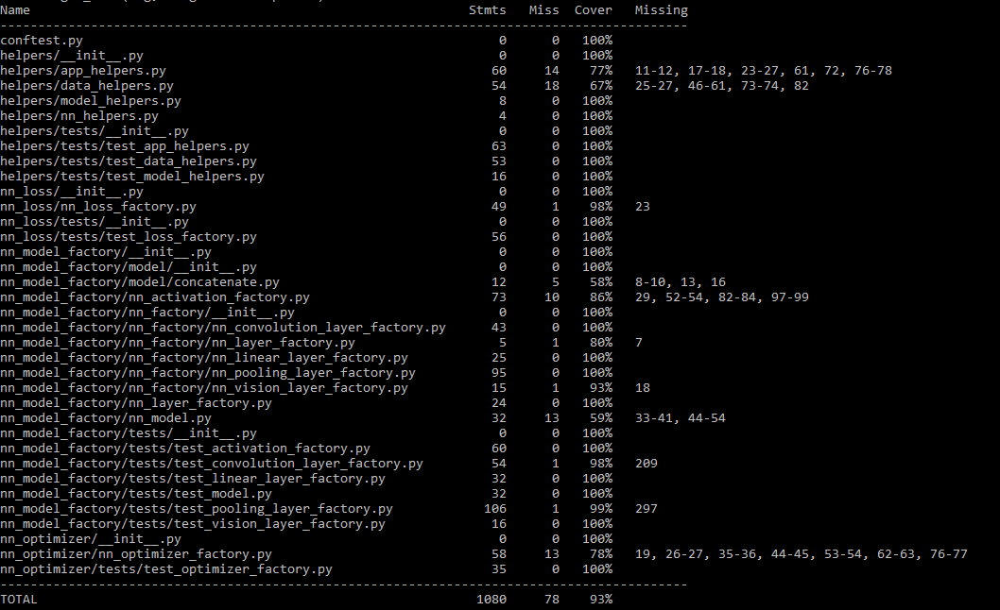

# Instance

## Description

As explained in the Architecture section of the write-up, the Instance represents the lowest level of computation in our implementation. Instances are independent, self-contained servers that are concerned with the learning tasks at hand.

Relating to the Federated Learning paradigm, instances represent devices. Instances are capable of participating in a Federated Learning training round, and simulate real-world devices by providing their availability and having a chance of failure during training.

In terms of functionality, the instance works directly with the neural network models and datasets. They have specialised endpoints that can be targeted to provide specific functionalities. However, instances together comprise an **environment**, thus they can only be reached through a [main controller](../main_controller/README.md).

Due to their set-up, the controllers use the same default instance docker image for all created environments. This allows for significant performance increase and sustainable maintance. However, instances can be personalised by targeting endpoints which can set-up instance-specific settings - such as probability of failure during training.

In terms of development, instances have been built using Python and [Flask](https://flask.palletsprojects.com/en/2.0.x/). Moreover, because instances perform machine learning tasks, instances rely heavily on [PyTorch](https://pytorch.org) to build newtorks, train and validate them.

## Structure

The code has been split up into folders that are independent and have single responsiblity within their effects.

- config: contains yaml configuarion files that store instance-specific configurations. Currently, we store the probability of failure during training
- error_handlers: contains a class that wraps around the default [abort](https://flask.palletsprojects.com/en/2.0.x/api/#flask.abort) function to be able to log errors to files as well.
- helpers: contrains various suits of Python script files that provide functions which are used in [routes](./routes/). These functions have single responsibilities, and they encapsulate the mechanism for specific functionality - e.g., creating a neural network model given a set of specifications.
- logs: it is the folder where logs are saved to during execution. Logs have been ignored in the repository due to their size.
- nn_loss: contains the factory class for creating loss functions given a set of requirements in JSON format.
- nn_model_factory: contains a suite of factory classes and methods for creating layers and activations for neural networks. contrains the suite of endpoints handlers. It also contains custom made classes - such as Concatenate - that is used as an additional layer in case of specific operations required in complex neural network architectures - such as U-Net with upsampling.
- nn_optimizer: contains the factory class for creating optimisers required during training. It works on the same principle as the aforementioned factories.
- routes: defines the various endpoints instances can act upon.
- train_data, train_labels, test_data, test_labels, validation_data, validation_labels: folders that store the dataset partitions for the specific instance
- Files outside of folders: some files were left outside of folders due to python style of organisation and imports. There are also files generated during training that were left outside due to the required scope.

## Endpoints

We provide a list of endpoints that can be targeted inside instances bellow.

### Model endpoints

- **/model/create**: it is responsible for the creation of neural network models. The endpoint uses the specifications from the given JSON to build the model dynamically. Once a model has been built, it saves it locally to a pre-defined path.
- **/model/train**: the endpoint is used to train the previously created model. In case a model was not defined beforehand, it stops the execution and throws a server error. The endpoint creates the loss function, optimizer and loads the training data using the various factory classes and specialised functions. The function that handles the endpoint is also capable of performing normalisation and standardisation - if specified by the user - and could be made to apply post-processing to the output as well. At the end, it saves the resulting model, updating its local copy, and sends back the model as a response.
- **/model/validate** - the endpoint is very similar to the train endpoint, as it performs a similar process to carry out validation. However, the model is not affected in any way during validation, and only the loss is computed and returned as a response.
- **/model/update** - the endpoint is targeted during a Federated Learning round to update the local model using the aggregated, global model.

### Instance endpoints

- **/instance/availability**: it is responsible to provide the instance availability. Currently, instances are always available, but could be easily be changed to a dynamic configuration set by users.
- **/instance/probabilityoffailure**: it is responsible to set the probability of failure for the instance. It saves the configuration to the configuration file in the [config](./config/instance_configuration.yaml) directory.

### Dataset endpoint

- **/dataset/add**: it is responsible to process incoming datasets. It saves the given files to directories pertaining to training, test or validation data or labels.
- **/dataset/remove**: the endpoint can be used to delete a specific dataset from the instance.

## Docker

The Dockerfile used to build the instance images performs some required initial set-up to install the necessary python libraries.

We have also extensively used a [docker-compose](./docker-compose.yml) file during development to create self-contained environments for testing instances. The compose files could also be further used when deploying the instances to any host.

To run the controller locally, execute:

```Docker
docker-compose up --build
```

## Tests

Various _tests_ folders can be found inside the aforementioned structures. We aimed at getting above 70% code coverage from our tests, and provide a result of code coverage for the components in the instance:


