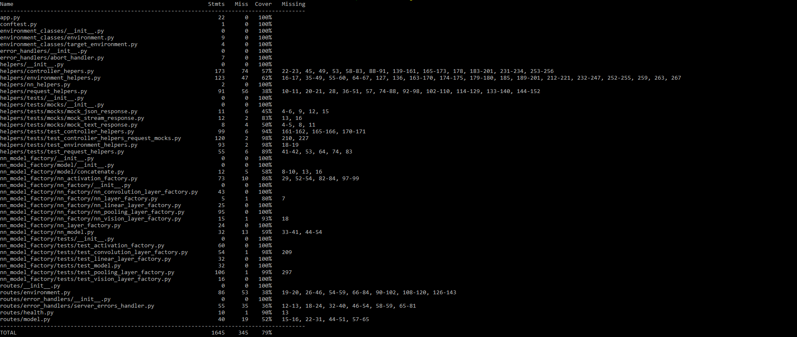

# Main Controller

## Description

As explained in the Architecture section of the report, the Main Controller represents the servers that interact directly with environments, and implicitely [instances](../instance/README.md). The Main Controller is responsible to handle interactions with the environments based on the requests received from the [Backend server](../backend_server/README.md).

The Main Controller servers are stateless, thus they can interact with any environment without prior connectivity to them. This allows an efficient approach to handling requests, as no state has to be stored and shared among controllers. Moreover, it makes controllers especially reliable and failure safe, as any other controller can pick up the work of a controller that crashed, is restarting or has just been added to the cluster of controllers.

In our implementation, the docker service takes care of restarting the controllers in the event they crash. However, we realise that a stable infrastructure should also monitor the health of controllers constantly and do more complex operations to handle such cases.

Abstracting on the idea of Federated Learning, the Main Controllers act as the centralised server that controls the learning process: from setting up the process using training parameters, to finding available devices, handling their training, aggregating models, and sharing model updates with all available instances.

Overall, the controllers have been developed using Python and [Flask](https://flask.palletsprojects.com/en/2.0.x/), but they also contain snippets of HashiCorp Configuration Language for [Terraform](https://www.terraform.io) and also contains Dockerfiles to allow building [Docker](https://www.docker.com) images and containers

## Structure

The code has been split up into folders that are independent and have single responsiblity within their effects.

- config: contains a json file for available status codes for environments. These codes are used to update the status an environment is in during creation, error, training, etc.
- environment_classes: contains a few classes that wrap around information needed to interact with environments.
- error_handlers: contains a class that wraps around the default [abort](https://flask.palletsprojects.com/en/2.0.x/api/#flask.abort) function to be able to log errors to files as well.
- helpers: contains various suits of Python script files that provide functions which are used in [routes](./routes/). These functions have single responsibilities, and they encapsulate the mechanism for specific functionality - e.g., creating an environment with terraform.
- logs: it is the folder where logs are saved to during execution. Logs have been ignored in the repository due to their size.
- models: contains models that have been saved locally during training.
- nn_model_factory: The same folder as in [instance](../instance/README.md). It contains the necessary classes for creating models due to the requirements of [PyTorch](https://pytorch.org) to be able to save, read and update models.
- routes: contains the suite of endpoints handlers.
- terraform: contains the files necessary to interact with Terraform to build the required infrastructure.
- Files outside of folders: some files were left outside of folders due to python style of organisation and imports.

## Endpoints

We provide a list of endpoints that can be targeted inside controllers below:

### Model endpoints

- **/model/create** (POST): it is responsible for the creation of models on each instances inside a given environment. The endpoint expects to receive the user id of the authenticated user, the specific environment pertaining to that user id and the neural network options - i.e., classes in PyTorch and their respective parameters.
- **/model/train** (POST): the endpoint is responsible for performing Federated Learning using a specific environment. It also expects a user id, and environment id to interact with, while it also requires training options - global options performed on the controller - the number of minimum available devices to start training, and training parameters for instances. This endpoint performs Federated Learning in an asynchronous manner to maximise performance on controllers and instances, reduce the time required for training and keeping connections open, and taking advantage of the multithreaded architecture present on the servers running the controllers. The final model is sent back to the Backend server to be made available for download.
- **/model/loss** (POST) - the endpoint can be used to perform various losses on a trained model. It requires the user id, environment id and the parameters used during loss computation.

### Environment endpoints

- **/environment/create** (POST): the endpoint takes care of creating an environment. Given a user id, and instance options - including what type of [Compute Engine instance](https://cloud.google.com/compute#section-6) to use for each instance - it will use Terraform to build the required number of devices (instances) on Google Cloud. All instances use the same base Docker image, however they can be configured with different parameters in terms of the underlying hardware to be used or probability of failure during training.
- **/environment/delete** (DELETE): the endpoint is responsible to cleanup an environment. It expects a user id and an environment id pertaining to that user to be able to destroy the instances.

The following three endpoints are related to distributing data to each instance within an environment and have similar workflows. Thus, we give a broader definition here that applies to all of them. Each endpoint expects a user id and an available environment id to interact with, together with a set of files to be shared with instances. The endpoints take care of sharing the data with the right instances, with the correct distribution if needed.

- **/environment/dataset/data** (POST): this endpoint is concerned with training data. This endpoint also expects a distribution for the training dataset to be set before, thus it can fail if no distribution was set a priori.
- **/environment/dataset/validation** (POST): this endpoint is concerned with validation data.
- **/environment/dataset/test** (POST): this endpoint is concerned with test data.

- **/environment/dataset/distribution/** (POST): this endpoint is concerned with saving the distribution of data for each instance during training. The endpoint expects a user id and an environment id, and saves the information related to distribution of data during training inside the database.

### Health endpoint

- **/health/status** (GET): this endpoint may be used to check the health status of a controller.

## Docker

The Dockerfile used to build the controller images performs some required initial set-up to be able to work with terraform, and install the necessary python libraries.

We have also extensively used a [docker-compose](./docker-compose.yml) file during development to create self-contained environments for testing controllers. The compose files could also be further used when deploying the controllers to any host.

To run the controller locally, execute:

```Docker
docker-compose up --build .
```

By default, the controller should be found on localhost:5000 or localhost:5001. Please check your docker desktop or use the docker CLI to identify the port.

## Tests

Various _tests_ folders can be found inside the aforementioned structures. We aimed at getting above 70% code coverage from our tests, and provide a result of code coverage for the components in the main controller:


To run the tests, you need to connect to the container in an interactive shell. This can either be done through docker desktop by clicking the button to open the shell, or you can find the container id and run:
`docker container <id> exec -it sh`.

Once the interactive shell is opened, it will look the same as the Linux shell. To run the tests simply execute:
`pytest`. To run coverage and print report run:
`coverage run -m pytest && coverage report -m`
